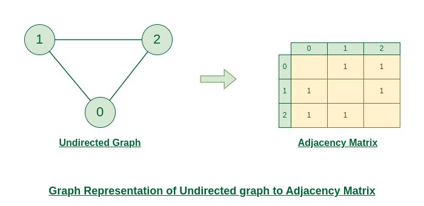
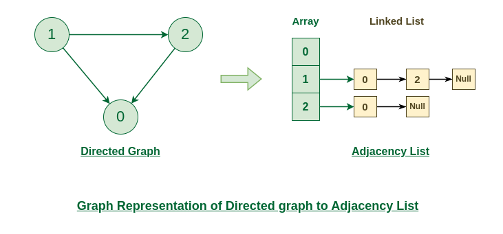

# Graph 

> A Graph is a non-linear data structure consists of vertices and edges. 
The vertices are sometimes referred to as node and the edges are lines or arcs that connect any two nodes in the graph.
More formally a Graph is composed of a set of vertices(V) and a set of edges(E). The graph is denoted by G(V, E).

# 1  Representation of Graph
Two common way to represent a graph is:
1. Adjacency Matrix
2. Adjacency List

## 1.1   Adjacency Matrix
An adjacency matrix is a way of representing a graph as a matrix of boolean (0’s and 1’s).
Let’s assume there are n vertices in the graph So, create a 2D matrix adjMat[n][n] having dimension n x n.
- If there is an edge from vertex i to j, mark adjMat[i][j] as 1.
- If there is no edge from vertex i to j, mark adjMat[i][j] as 0.

#### Representation of Undirected Graph to Adjacency Matrix:

#### Representation of Directed Graph to adjacency Matrix: 

. 
Each index in this array represents a specific vertex in the graph. 
The entry at the index i of the array contains a linked list containing the vertices that are adjacent to vertex i.

- adjList[0] will have all the nodes which are connected (neighbour) to vertex 0.
- adjList[1] will have all the nodes which are connected (neighbour) to vertex 1 and so on.

#### Representation of Undirected Graph to Adjacency list:

#### Representation of Directed Graph to Adjacency list:

