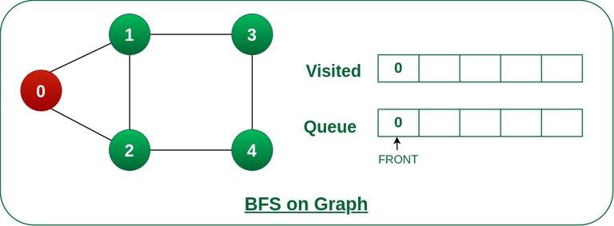

# Breadth First Search (BFS) for a graph

Breadth First Search (BFS) is a graph traversal algorithm that explores all the vertices in a graph at the current level before moving on to the vertices at the next depth level.
It starts at a specified vertex and visits all its neighbors before moving on to the next level of neighbors.

BFS is commonly used in algorithms for pathfinding, connected components, and shortest path problems in graphs.

## BFS Algorithm:
Breadth First Search (BFS) for a Graph Algorithm:

```text
1. Initialization: Enqueue the starting node into a queue and mark it as visited.
2. Exploration: While the queue is not empty:
    2.1 Dequeue a node from the queue and visit it (e.g., print its value).
    2.2 For each unvisited neighbor of the dequeued node:
        2.2.1 Enqueue the neighbor into the queue.
        2.2.2 Mark the neighbor as visited.
3. Termination: Repeat step 2 until the queue is empty.
```

### Illustration
Step1: Initially queue and visited arrays are empty. 


Step 2: Push node 0 into queue and mark it visited.



Step 3: Remove node 0 from the front of queue and visit the unvisited neighbours and push them into queue.


Step 4: Remove node 1 from the front of queue and visit the unvisited neighbours and push them into queue.


Step 5: Remove node 2 from the front of queue and visit the unvisited neighbours and push them into queue.


Step 6: Remove node 3 from the front of queue and visit the unvisited neighbours and push them into queue.
As we can see that every neighbours of node 3 is visited, so move to the next node that are in the front of the queue.


Steps 7: Remove node 4 from the front of queue and visit the unvisited neighbours and push them into queue.
As we can see that every neighbours of node 4 are visited, so move to the next node that is in the front of the queue.


Now, Queue becomes empty, So, terminate these process of iteration.


### Implementation

```java
package org.example.ds.graph.bfs;

import java.util.ArrayList;
import java.util.LinkedList;
import java.util.List;
import java.util.Queue;


public class Graph {
    int vertices;
    LinkedList<Integer>[] adjList;

    public Graph(int vertices) {
        this.vertices = vertices;
        adjList = new LinkedList[vertices];
        for(int i=0; i<vertices; i++){
            adjList[i] = new LinkedList<Integer>();
        }
    }

    // Undirected Graph
    void addEdge(int src, int dest) {
        this.adjList[src].add(dest);
    }

    List<Integer> bfs() {
        int N = vertices;
        boolean[] visited = new boolean[N];

        List<Integer> bfsOrder = new ArrayList<>();
        for(int i=0; i<N; i++) {
            if(!visited[i]) {
                List<Integer> list = bfsUtil(i, visited);
                bfsOrder.addAll(list);
            }
        }
        return bfsOrder;
    }


    private List<Integer> bfsUtil(int vertex, boolean[] visited) {
        List<Integer> list = new ArrayList<>();
        Queue<Integer> q = new LinkedList<>();
        visited[vertex] = true;
        q.offer(vertex);

        while(!q.isEmpty()) {
            int N = q.size();
            for(int i=0; i<N; i++) {
                int v = q.poll();
                list.add(v);
                for(int adjNode : adjList[v]) {
                    if(!visited[adjNode]) {
                        visited[adjNode] = true;
                        q.offer(adjNode);
                    }
                }
            }
        }
        return list;
    }

}

```

### Test

```java
package org.example.ds.graph.bfs;

import org.junit.jupiter.api.DisplayName;
import org.junit.jupiter.api.Test;

import java.util.List;

import static org.junit.jupiter.api.Assertions.*;

class GraphBFSTest {
    @Test
    @DisplayName("BFS Test1")
    void bfsTest1() {
        Graph g = new Graph(4);
        g.addEdge(0, 1);
        g.addEdge(0, 2);
        g.addEdge(1, 2);
        g.addEdge(2, 0);
        g.addEdge(2, 3);
        g.addEdge(3, 3);
        List<Integer> bfsOrder = g.bfs();
        assertIterableEquals(List.of(0,1,2,3), bfsOrder);
    }

    @Test
    @DisplayName("BFS Test2")
    void bfsTest2() {
        Graph g = new Graph(5);
        // Add edges to the graph
        g.addEdge(0, 1);
        g.addEdge(0, 2);
        g.addEdge(1, 3);
        g.addEdge(1, 4);
        g.addEdge(2, 4);
        List<Integer> bfsOrder = g.bfs();
        assertIterableEquals(List.of(0,1,2,3,4), bfsOrder);
    }
}
```