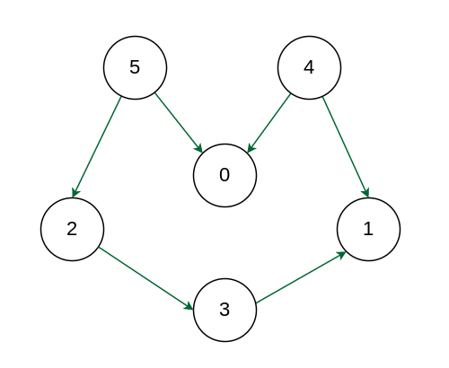

# Topological Sorting

Topological sorting for Directed Acyclic Graph (DAG) is a linear ordering of vertices such that for every directed edge u-v, vertex u comes before v in the ordering.

Note: Topological Sorting for a graph is not possible if the graph is not a DAG.


Input Graph :



Output: 5 4 2 3 1 0

Explanation: The first vertex in topological sorting is always a vertex with an in-degree of 0 (a vertex with no incoming edges). A topological sorting of the following graph is “5 4 2 3 1 0”. 

There can be more than one topological sorting for a graph. Another topological sorting of the following graph is “4 5 2 3 1 0”.

### Topological Sorting vs Depth First Traversal (DFS):
In DFS, we print a vertex and then recursively call DFS for its adjacent vertices. 
In topological sorting, we need to print a vertex before its adjacent vertices.

 In the above given graph, the vertex ‘5’ should be printed before vertex ‘0’, but unlike DFS, the vertex ‘4’ should also be printed before vertex ‘0’.
 So Topological sorting is different from DFS. For example, a DFS of the shown graph is “5 2 3 1 0 4”, but it is not a topological sorting.

### Topological Sorting in Directed Acyclic Graphs (DAGs)
DAGs are a special type of graphs in which each edge is directed such that no cycle exists in the graph,
- **Topological sorting is not possible for graph with undirected edges:** This is due to the fact that undirected edge between two vertices u and v means, 
there is an edge from u to v as well as from v to u. 
Because of this both the nodes u and v depend upon each other and none of them can appear before the other in the topological ordering without creating a contradiction.

- **Topological sorting not possible for graph having cycles:** All the vertices in a cycle are indirectly dependent on each other hence topological sorting fails.

<hr />

### Implementation

```java
package org.example.ds.graph.topology;

import java.util.ArrayList;
import java.util.LinkedList;
import java.util.List;
import java.util.Stack;

public class Graph {
    int vertices;
    List<List<Integer>>  adjList = new ArrayList<List<Integer>>();
    Graph(int vertices) {
        this.vertices = vertices;
        for(int i=0; i<vertices; i++) {
            adjList.add(new LinkedList<>());
        }
    }

    void addEdge(int src, int dest) {
        adjList.get(src).add(dest);
    }

    List<Integer> topologicalSort() {
        Stack<Integer> stack = new Stack<>();
        boolean[] visited = new boolean[vertices];
        for(int i=0; i<vertices; i++) {
            if(!visited[i]) {
                dfs(i, visited, stack);
            }
        }
        List<Integer> topologicalOrder = new ArrayList<>();
        while(!stack.isEmpty()) {
            topologicalOrder.add(stack.pop());
        }
        return topologicalOrder;
    }

    void dfs(int vertex, boolean[] visited, Stack<Integer> stack) {
        if(visited[vertex]) return;
        visited[vertex] = true;
        for(int w: adjList.get(vertex)) {
            if(!visited[w]) {
                dfs(w, visited, stack);
            }
        }
        stack.push(vertex);
    }
}


```
### Test

```java
package org.example.ds.graph.topology;

import org.junit.jupiter.api.Assertions;
import org.junit.jupiter.api.DisplayName;
import org.junit.jupiter.api.Test;

import java.util.List;

class TopologicalSortTest {
    @Test
    @DisplayName("Topological order test1")
    public void topologicalSortTest1() {
        Graph g = new Graph(6);
        g.addEdge(5, 2);
        g.addEdge(5, 0);
        g.addEdge(4, 0);
        g.addEdge(4, 1);
        g.addEdge(2, 3);
        g.addEdge(3, 1);
        List<Integer> topologyOrder = g.topologicalSort();
        System.out.println(topologyOrder);
        Assertions.assertIterableEquals(List.of(5,4,2,3,1,0),  topologyOrder);
    }

    @Test
    @DisplayName("Topological order test2")
    public void topologicalSortTest2() {
        Graph g = new Graph(4);
        g.addEdge(0, 1);
        g.addEdge(1, 2);
        g.addEdge(3, 1);
        g.addEdge(3, 2);
        g.topologicalSort();
        List<Integer> topologyOrder = g.topologicalSort();
        System.out.println(topologyOrder);
        Assertions.assertIterableEquals(List.of(3,0,1,2),  topologyOrder);
    }
}
```


### Problem:
https://www.geeksforgeeks.org/problems/topological-sort/1
Given a Directed Acyclic Graph (DAG) with V vertices and E edges, Find any Topological Sorting of that Graph.

Solution:
```java
class Solution {
    //Function to return list containing vertices in Topological order. 
    static int[] topoSort(int V, ArrayList<ArrayList<Integer>> adj) {
        // add your code here
        boolean[] visited = new boolean[V];
        Stack<Integer> stack = new Stack<>();
        for(int i=0; i<V; i++) {
            if(!visited[i]) {
                topologicalOrder(i, visited, adj, stack);
            }
        }
        int[] order = new int[V];
        for(int i=0; i<V; i++) {
            order[i] = stack.pop();
        }
        return order;
    }

    static void topologicalOrder(int vertex, boolean[] visited, ArrayList<ArrayList<Integer>> adjList, Stack<Integer> stack){
        visited[vertex] = true;
        for(int w: adjList.get(vertex)) {
            if(!visited[w]) {
                topologicalOrder(w, visited, adjList, stack);
            }
        }
        stack.push(vertex);
    }
}
```
