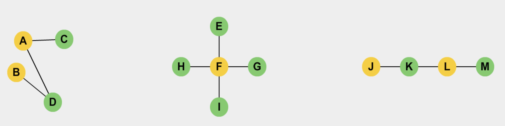

# Bipartite Graph

A Bipartite Graph is a special kind of Graph, 
in which the vertices can be divided into two disjoint sets U and V such that no vertex of U is adjacent to any other vertex in U 
and no vertex of V is adjacent to any other vertex in V. 
Vertices in U have edges that connect it to vertices in V.


The graph G is a bipartite graph if:

- The vertex set V of G can be partitioned into two disjoint and independent sets V1 and V2
- All the edges from the edge set E have one endpoint vertex from the set V1 and another endpoint vertex from the set V2


Bipartite Graphs



The above graphs are Bipartite.

- Yellow-colored vertices belong to a disjoint set U.
- Green colored vertices belong to a disjoint set V.

One can observe in the above graphs that no vertex of U is adjacent to any other vertex in U, and no vertex of V is adjacent to any other vertex in V.

<hr />

### Problem 

Check if a graph is bipartite https://leetcode.com/problems/is-graph-bipartite/description/

Solution:
```java
package org.example.ds.graph.bipartite;

import java.util.ArrayList;
import java.util.LinkedList;
import java.util.List;
import java.util.Queue;

public class Graph {
    List<LinkedList<Integer>> adjList = new ArrayList<>();
    int vertices;
    Graph(int vertices) {
        this.vertices = vertices;
        for(int i=0; i<vertices; i++) {
            adjList.add(new LinkedList<>());
        }
    }

    void addEdge(int src, int dest) {
        adjList.get(src).add(dest);
    }

    boolean isBipartite() {
        int[] color = new int[vertices];
        for(int i=0; i<vertices; i++) {
            //if not colored node
            if(color[i] == 0) {
                if(!isBipartite(i, color)) {
                    return false;
                }
            }
        }
        return true;
    }

    private boolean isBipartite(int vertex, int[] color) {
        // color with 1st color
        color[vertex] = 1;
        Queue<Integer> q = new LinkedList<>();
        q.offer(vertex);
        while(!q.isEmpty()) {
            int node = q.poll();
            for(int w: adjList.get(node)) {
                if(color[w] == 0) {
                    // color node of opposite color
                    color[w] = color[node] == 1 ? 2 : 1;
                    q.offer(w);
                } else {
                    // if adj node is already colored check that it should not be of same color
                    if(color[w] == color[node]) {
                        return false;
                    }
                }
            }
        }
        return true;
    }
}

```

Test 

```java
package org.example.ds.graph.bipartite;

import org.junit.jupiter.api.DisplayName;
import org.junit.jupiter.api.Test;

import static org.junit.jupiter.api.Assertions.*;

class BipartiteGraphTest {

    @Test
    @DisplayName("Bipartite Graph Test1")
    public void bipartiteGraphTest1() {
        Graph g = new Graph(4);
        g.addEdge(0,1);
        g.addEdge(0,2);
        g.addEdge(0,3);
        g.addEdge(1,0);
        g.addEdge(1,2);
        g.addEdge(2,0);
        g.addEdge(2,1);
        g.addEdge(2,3);
        g.addEdge(3,0);
        g.addEdge(3,2);
        assertFalse(g.isBipartite());
    }

    @Test
    @DisplayName("Bipartite Graph Test2")
    public void bipartiteGraphTest2() {
        Graph g = new Graph(4);
        g.addEdge(0,1);
        g.addEdge(0,3);
        g.addEdge(1,0);
        g.addEdge(1,2);
        g.addEdge(2,1);
        g.addEdge(2,3);
        g.addEdge(3,0);
        g.addEdge(3,2);
        assertTrue(g.isBipartite());
    }

}
```