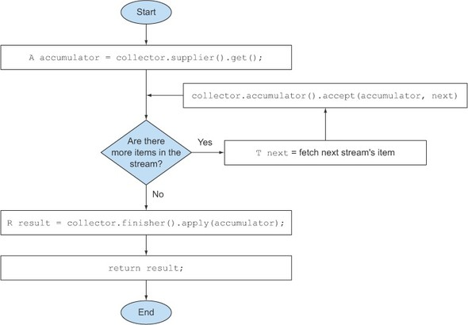

# Collector Interface

The Collector interface consists of a set of methods that provide a blueprint for how to implement specific reduction operations (that is, collectors). We know many collectors from [java.util.stream.Collectors](https://docs.oracle.com/en/java/javase/21/docs/api/java.base/java/util/stream/Collectors.html) class that implement the Collector interface, such as toList or groupingBy.

```java
public interface Collector<T, A, R> {
    Supplier<A> supplier();
    BiConsumer<A, T> accumulator();
    Function<A, R> finisher();
    BinaryOperator<A> combiner();
    Set<Characteristics> characteristics();
}
```

In this listing, the following definitions apply:

- T is the generic type of the items in the stream to be collected.
- A is the type of the accumulator, the object on which the partial result will be accumulated during the collection process.
- R is the type of the object (typically, but not always, the collection) resulting from the collect operation.

### Logical steps of the sequential reduction process




A Custom ToListCollector Example
```java

public class ToListCollector<T> implements Collector<T, List<T>, List<T>> {

    @Override
    public Supplier<List<T>> supplier() {
        return ArrayList::new;
    }

    @Override
    public BiConsumer<List<T>, T> accumulator() {
        return List::add;
    }

    @Override
    public BinaryOperator<List<T>> combiner() {
        return (a, b) -> {
            a.addAll(b);
            return a;
        };
    }

    @Override
    public Function<List<T>, List<T>> finisher() {
        return Function.identity();
    }

    @Override
    public Set<Characteristics> characteristics() {
        return EnumSet.of(Characteristics.CONCURRENT, Characteristics.IDENTITY_FINISH);
    }
}

```
